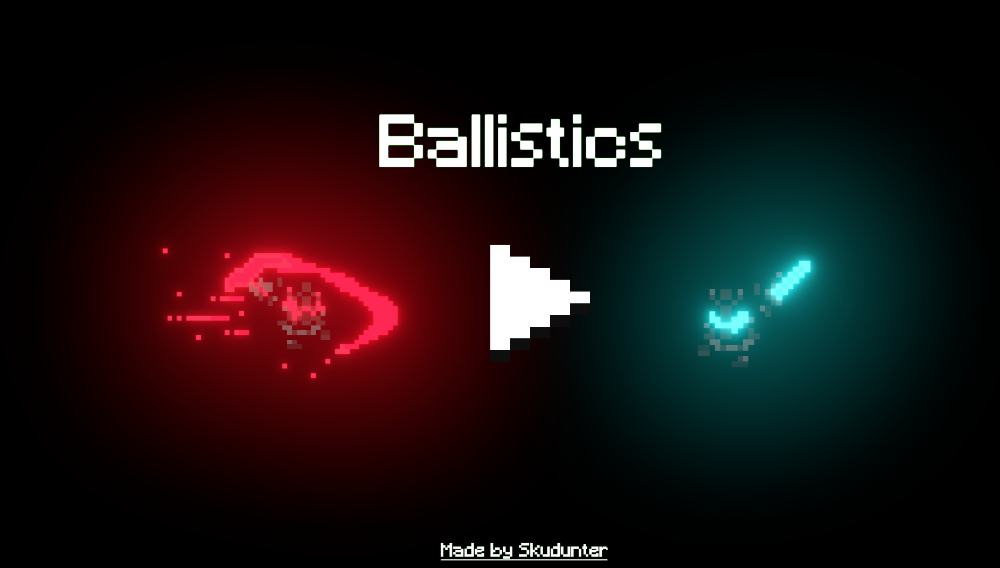

# Ballistics

## Overview

I am excited to showcase my project, a local multiplayer game developed in Unity. This game offers an engaging and competitive experience for two players who can run around and engage in intense battles. Below, I'll provide an overview of the project and its key features.

## Game Concept

### Description

Ballistics is a thrilling local multiplayer game designed to bring friends and family together for hours of entertainment. In this game, two players enter an immersive 2D world where they control unique characters. The primary objective is to engage in exciting battles, testing each player's skills and reflexes.

### Key Features

- **Local Multiplayer:** The game supports local multiplayer gameplay, allowing two players to compete against each other on the same device, fostering a sense of camaraderie and rivalry.

- **Attack :** Engage in thrilling battles by utilizing a variety of attacks with knockback.

## Technologies Used

- **Unity Game Engine:** The game is developed using Unity, showcasing my proficiency in game development with this versatile engine.

- **C# Programming:** Extensive use of C# scripting to implement gameplay mechanics, player controls, and interactive elements.

