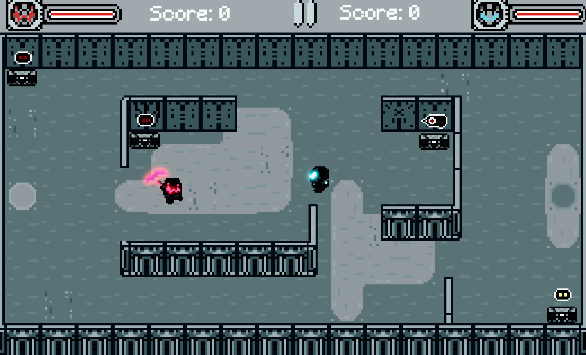

# Ballistics

## Description

Ballistics is my first real Unity game where two players run around,collect powerups and attack eachother.

### Key Features

- **Local Multiplayer:** The game supports local multiplayer gameplay, allowing two players to compete against each other on the same device.

- **Attack :** Engage in thrilling battles by utilizing a variety of attacks with knockback.

## Technologies Used

- **Unity Game Engine:** The game is developed using Unity, showcasing my proficiency in game development with this versatile engine.

- **C# Programming:** Extensive use of C# scripting to implement gameplay mechanics, player controls, and interactive elements.

## Links

- [Play Game](https://skudunter.itch.io/ballistics)

