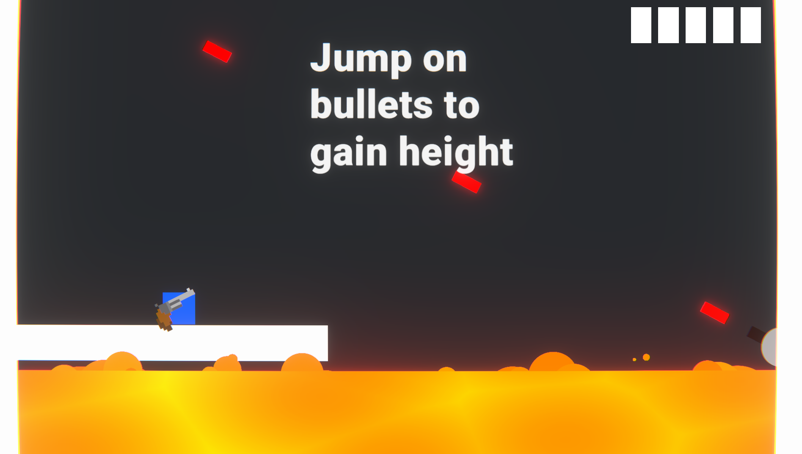
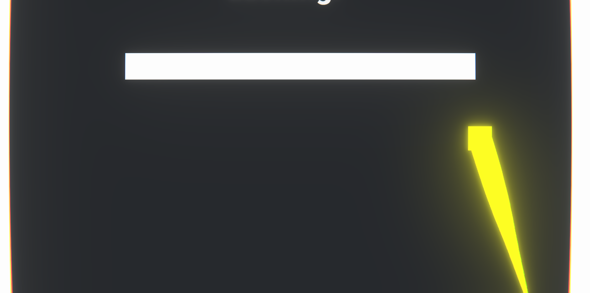

# Roles Reversed

## GMTK Game Jam

**Bullet Metamorphosis** was my entry for the GMTK game jam this year, centered around the theme of "Roles Reversed." In this platformer game developed using Unity, you'll find a unique twist where the bullets become your allies instead of your enemies.

## Gameplay

- **Bullet Allies**: Embrace the challenge of navigating through levels where bullets are not your foes but your trusted companions.
- **Platformer Action**: Enjoy the classic platformer experience with a creative twist.
- **GMTK Game Jam**: This game was created in the spirit of the GMTK game jam, highlighting innovative gameplay mechanics.
- **Dashing**: There is a mechanic where the player dashes through the air!

## Technologies Used

- **Unity**: The game engine powering this unique platformer.
- **C#**: The primary programming language for game logic.
- **URP Shader Graph**: The primary way of creating shaders to make the project look better.

## Links

- [Play Game](https://skudunter.itch.io/cubevolverbullet-metamorphosis)

