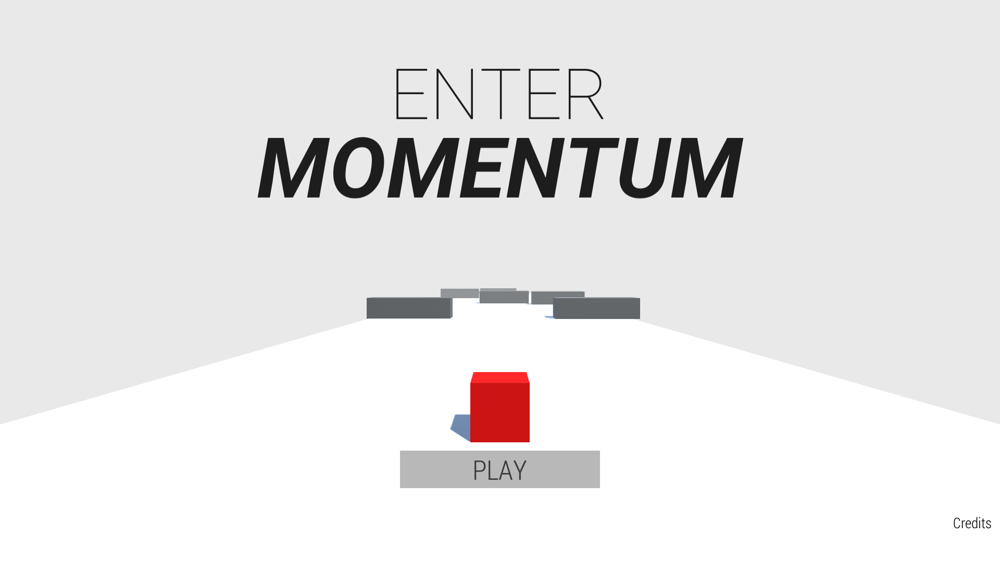

# Momentum

## About

As a game developer, I'm thrilled to have created my first 3D Unity game with the help of Brackeys' tutorial. The tutorial was an excellent starting point, but I knew I wanted to add some of my own artistic touches to the game. With procedural level generation, I was able to create a unique gameplay experience for players every time they played the game. Overall, it was an incredible learning experience, and I'm excited to continue developing games and exploring new techniques and tools in the future.

## Links

- [Game Download](https://skudunter.itch.io/momentum)
- [Unity](https://unity.com/)
- [Brackeys](https://brackeys.com/)
