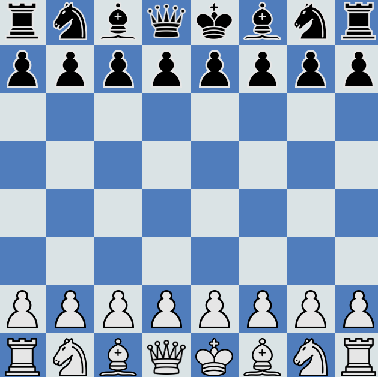

# Native Chess

## Introduction

**React Native Chess** represents a successful experiment in my journey to master React Native and Firebase. This application includes secure login and registration functionality through Firebase, along with a leaderboard and interactive gameplay. Throughout this project, I gained valuable experience in TypeScript, Firebase storage, Firebase authentication, and Expo development.

## Features

- Secure Login and Registration: Utilizing Firebase for user authentication.
- Leaderboard: Keep track of top players.
- Interactive Gameplay: Engage in exciting chess matches.

## Technologies Used

- **React Native**: The foundation for building the mobile app.
- **Firebase**: Powering user authentication and data storage.
- **TypeScript**: Ensuring a type-safe codebase.
- **Expo**: Streamlining development and deployment.

## Links

- [GitHub Repository](https://github.com/yourusername/react-native-chess)

Feel free to explore the code on GitHub. Dive into the world of chess with React Native Chess! 🚀

