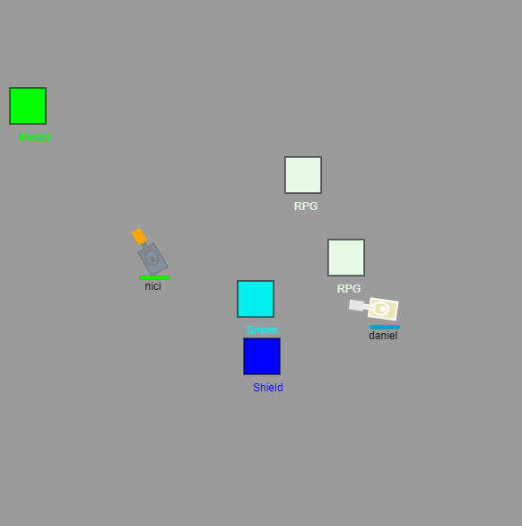

# Express Tanks

## About

As a developer, creating a multiplayer game using Node.js, Express, and Websocket.io was an exciting and challenging project. It was a great opportunity to hone my skills in real-time communication and networking, as well as designing and implementing game mechanics. With the addition of weapon upgrades and power-ups, the gameplay became more dynamic and engaging for players. Developing this game has allowed me to expand my knowledge and abilities in game development and networking, and I look forward to continuing to create engaging experiences for players in the future even though this was more of a proof of concept.

- hsaidisajdijsa
- sadsadasdasd
- asdsadasdasd

## Links

- [GitHub](https://github.com/skudunter/Express-Tanks)
- [Node.js](https://nodejs.org/en/)