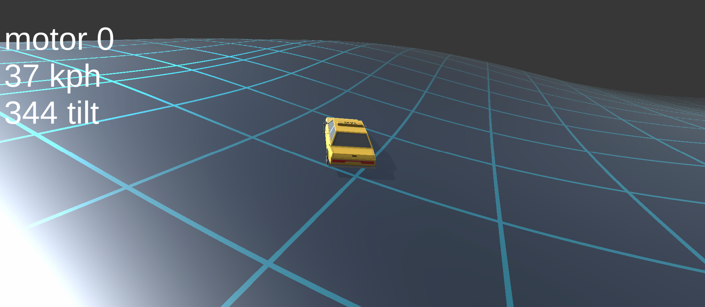

# Velocity

## Overview

_Velocity_ is an exciting Unity game project that I developed as part of my journey in computer science and web development. This project was created following a tutorial by Brackeys, focusing on procedural mesh generation. It showcases my skills in game development and Unity, highlighting my ability to implement complex game mechanics.

## Project Details

### Concept

_Velocity_ is an action-packed game where players control a fast-moving object, navigating through a dynamically generated environment filled with obstacles and challenges. The game leverages procedural mesh generation to create a unique and endless gaming experience, keeping players engaged and challenged.

### Key Features

- Procedural Mesh Generation: The game utilizes procedural mesh generation techniques to create a constantly evolving and unpredictable game world, enhancing replayability.
- Fast-Paced Gameplay: _Velocity_ offers a thrilling gaming experience with high-speed movement and responsive controls, testing the player's reflexes and agility.

## Technologies Used

- **Unity:** The game is built using the Unity game engine, demonstrating my proficiency in game development with this powerful tool.

- **C# Programming:** Extensive use of C# scripting to implement gameplay mechanics, procedural mesh generation, and interactive elements.

- **Graphics Design:** Utilized graphic design skills to create visually engaging game assets and effects.

## Perlin Noise Mesh Generation

**How Perlin Noise Mesh Generation Works:**

- **Understanding Perlin Noise:**

  - Perlin noise is a mathematical algorithm for generating coherent, smooth random patterns used in procedural content generation.

- **Grid and Sample Points:**

  - Start with a grid of sample points in 2D or 3D space, where each point represents a potential vertex in the mesh.

- **Assigning Random Values:**

  - At each sample point, assign a random value based on the Perlin noise function, which produces gradual and smooth transitions.

- **Interpolation:**

  - Interpolate between sample points using methods like linear or cubic interpolation to ensure smooth value transitions.

- **Combining Multiple Octaves:**

  - Create complexity by combining multiple "octaves" of noise, each with different amplitudes and frequencies.

- **Thresholding and Mesh Generation:**

  - Use the Perlin noise values as heightmaps or displacement maps for mesh generation or texturing.

- **Smoothing and Post-processing:**

  - Apply smoothing and post-processing techniques to improve visual quality and realism.

- **Real-time Updates:**

  - Adjust Perlin noise parameters in real-time for dynamic and randomly generated content in games.

- **Application:**
  - Perlin noise mesh generation is versatile and used for terrain generation, texture creation, cloud patterns, and more in computer graphics and game development.

