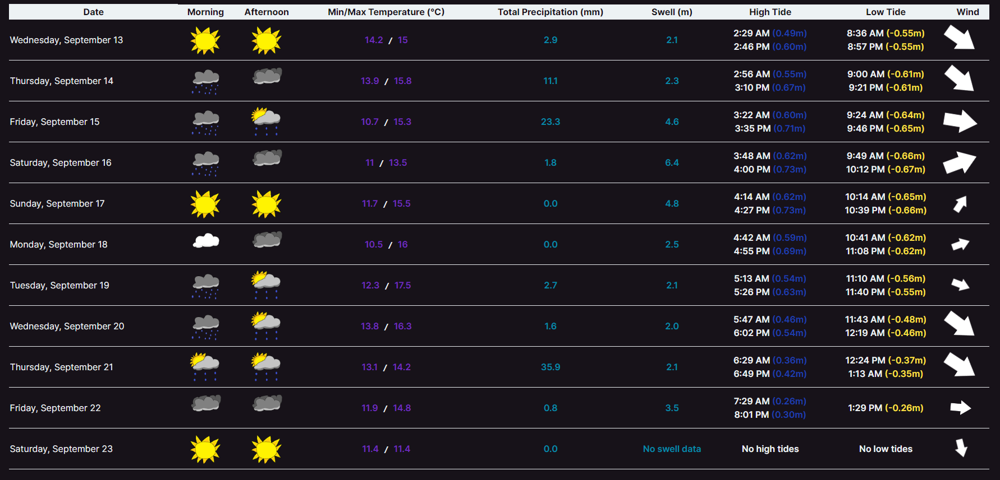
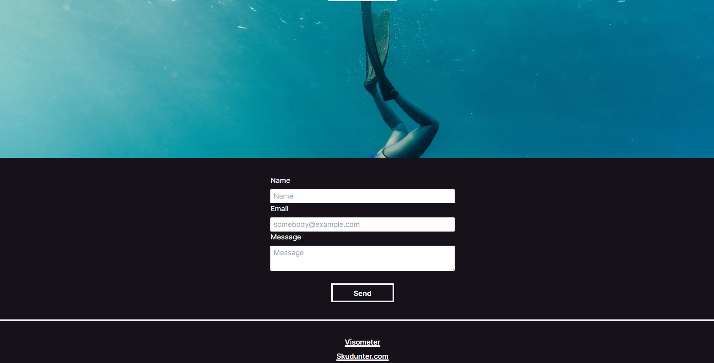

# Visometer 🤿🌊

## Introduction

**Visometer** is a web application I developed using Next.js, where I had the opportunity to dive into web development and create my own API endpoints. The project's main focus is to provide valuable weather data tailored specifically for diving conditions. 🌊

## Features

- **Diving Weather Data**: Skudunter utilizes APIs from **yr-weather** and **stormglass.io** to provide accurate and up-to-date weather information that's essential for divers.

## Technologies Used

- **Next.js**: I chose Next.js for this project, allowing for server-side rendering and a seamless user experience.
- **Custom API Endpoints**: I wrote my own API endpoints to fetch and display diving-relevant data.
- **Node.js**: The project's backend is powered by Node.js.
- **Environment Variables**: To ensure security, sensitive data such as API keys and email credentials are stored securely in an `.env.local` file.

## Links
- [Visometer](https://visometer.vercel.app/)
- [Github Repository](https://github.com/skudunter/kaboom-local-multiplayer-game)

