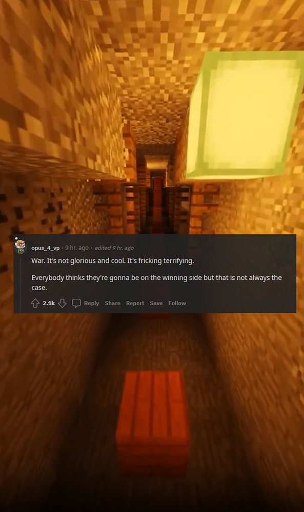

# Youtube Shorts Bot

## About

I was inspired by coding with lewis to start a project purely in Node.js where the user selects a subreddit, the text is then scraped and sent to Google TTS where it is converted to an mp3 file. After this, Puppeteer launches to capture screenshots, using basic math and FFmpeg wizardry, a video is the end result.

## Links

- [GitHub Repository](https://github.com/skudunter/javascript-reddit-content-creation-bot)
- [Coding with lewis](https://www.youtube.com/watch?v=3gjcY_00U1w)
